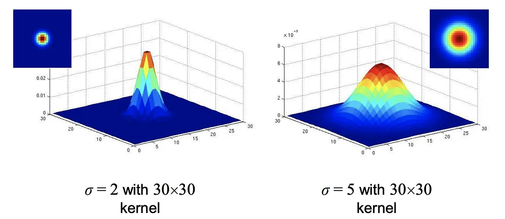

### __1. Blur filter:__
###   The blur filter is a widely used image processing technique that reduces the sharpness and details of an image by averaging the color values of neighboring pixels. It works by replacing each pixel's color value with the average color value of its surrounding pixels. This process effectively blurs the image and smoothens out any sharp edges or fine details.

### Advantages:
#### - The blur filter is a simple and effective way to reduce noise in an image.
#### - It is easy to implement and can be applied to any image without any prior knowledge of the image's content.
#### - It is computationally inexpensive and can be applied to large images in real-time.

### Disadvantages:
#### - The blur filter can reduce the sharpness of an image and make it appear blurry.
#### - Excessive blurring can result in loss of important details and fine textures.

### Mathematical equation:
#### - The blur filter is a linear filter that works by convolving the image with a kernel of ones. The kernel is a matrix of ones with a size of n x n, where n is an odd number. The kernel is then normalized by dividing each element by the sum of all elements in the kernel. The resulting kernel is then convolved with the image to produce the blurred image.

--- 

 

### __2. Gaussian filter:__
#### The Gaussian filter is a popular linear filter that applies a weighted average to each pixel of an image, with the weights determined by a Gaussian distribution. The Gaussian distribution is a bell-shaped curve that assigns higher weights to the pixels closer to the center and lower weights to the pixels further away. This filter is effective in reducing noise while preserving the edges and fine details of the image.

### Advantages:
#### - Gaussian filtering reduces noise effectively while maintaining image quality.
#### - It can be adjusted by varying the standard deviation parameter to control the level of blurring.
#### -The Gaussian filter is relatively simple to implement and computationally efficient.

### Disadvantages:

#### - Strong blurring can still result in loss of some image details.
#### - The size of the filter kernel affects the level of blurring and computation time.

### Mathematical equation:
#### The values from function above will create the convolution matrix / kernel that we’ll apply to every pixel in the original image. The kernel is typically quite small — the larger it is the more computation we have to do at every pixel.

#### Where, sigma is the standard deviation of the Gaussian distribution. If it is not given, it is calculated using the kernel size. 
#### x and y are the distances from the origin in the horizontal and vertical axis, respectively.
#### The Gaussian filter alone is not enough to remove noise from the image. It is always used with other filters like Median filter, Bilateral filter in order to remove noise effectively.

#### By setting the standard deviation 𝛔, we can control until what certain extent we smooth the image. In other words, the higher the standard deviation gets the stronger effect of smoothing effect the image has.

---

 

### __3. Median filter:__
#### The median filter is a non-linear filter that replaces each pixel's value with the median value of its neighboring pixels. It is particularly effective in removing impulse noise or salt-and-pepper noise, which are random and isolated pixels with extreme values. By replacing outliers with the median value, the median filter preserves edges and fine details while reducing noise.

### Advantages:

#### - Effective at removing impulse noise without significantly blurring the image.
#### - Preserves edges and fine details better than linear filters.
#### - The median filter is relatively simple to implement and computationally efficient.

### Disadvantages:

#### - It may not be as effective in reducing other types of noise, such as Gaussian or uniform noise.
#### -The size of the filter kernel can affect the level of noise reduction and computation time.

### Mathematical equation:
#### The median filter replaces each pixel value with the median value of its neighboring pixels. 

---

 

### __4. Bilateral filter:__
#### Is a non-linear, edge-preserving and noise-reducing smoothing filter for images. It replaces the intensity of each pixel with a weighted average of intensity values from nearby pixels. This weight can be based on a Gaussian distribution. Crucially, the weights depend not only on Euclidean distance of pixels, but also on the radiometric differences (e.g., range differences, such as color intensity, depth distance, etc.). This preserves sharp edges.

### Advantages:
#### - Bilateral filtering effectively reduces noise while preserving important edges and fine details.
#### - It allows for adjustable blurring and edge preservation by adjusting the filter parameters.
#### - The filter is versatile and can be applied to various types of images.

### Disadvantages:
#### - The bilateral filter is computationally expensive and can be slow to apply to large images.
#### - The filter parameters can be difficult to tune for optimal results.

### Mathematical equation:
#### Replaces each pixel with a weighted average of itself and its neighbors, where the weight decreases with distance from the pixel.

#### Where: 1/Wp is the normalization factor, which ensures that the sum of all the weights is 1. The second term is the spatial component, which is a function of the distance between the center pixel and the neighboring pixel. The third term is the range component, which is a function of the difference between the intensity of the center pixel and the intensity of the neighboring pixel. The spatial and range components are combined to form the weight of the neighboring pixel. The weight of the neighboring pixel is high if the neighboring pixel is close to the center pixel and if the intensity of the neighboring pixel is similar to the intensity of the center pixel. The weight of the neighboring pixel is low if the neighboring pixel is far from the center pixel and if the intensity of the neighboring pixel is different from the intensity of the center pixel. The neighboring pixels with high weights are used to restore the center pixel. The neighboring pixels with low weights are not used to restore the center pixel.