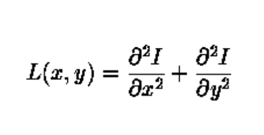
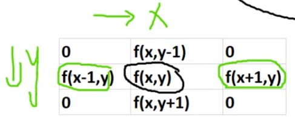
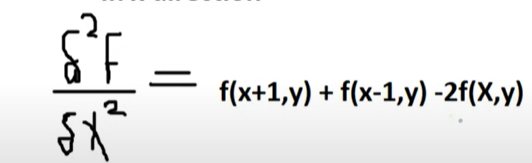
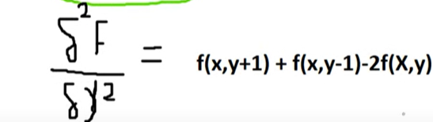
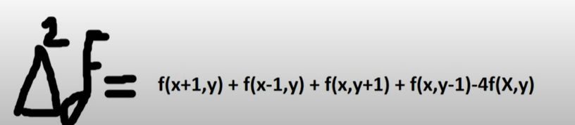
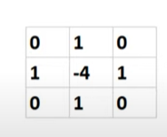
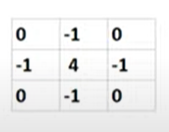
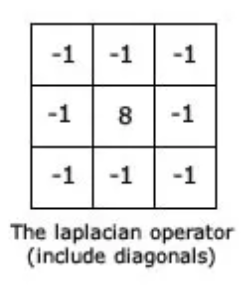

### Laplacian Filter: 
#### The Laplacian filter is a second-order derivative edge detector. It measures the second spatial derivative of the image intensity at each point, detecting zero crossings of the second derivative. The operator normally takes a single graylevel image as input and produces another graylevel image as output.

#### if we let f(x,y) be the input image and g(x,y) be the output image, then the Laplacian filter is given by the following equation:

### If we have  image with 3x3 kernel size, then we can apply the Laplacian filter using convolution as follows:

### in x direction:

### in y direction:

###  sum of the two results:

###  to ignore the center pixel when applying the Laplacian filter we can use the following kernel:

### to not ignore the center pixel when applying the Laplacian filter we can use the following kernel:

### to apply the laplacian filter including diagonal pixels we can use the following kernel:

----- 

### The choce of the kernel size is very important, because it will affect the result of the laplacian filter for example in the code below we have used 3x3 kernel size and 5x5 kernel size and we can see that the 3x3 kernel size is better than the 5x5 kernel size.

- #### There are many reasons for that: 
    - #### Sensitivity to Noise: A larger kernel size can have a stronger smoothing effect, which can reduce the impact of noise in the image. However, if the image has minimal noise or if preserving fine details is important, a smaller kernel size might be more suitable.
    - #### Edge Preservation: A smaller kernel size can better preserve fine edges in the image. When the kernel size is larger, it can blur or smooth out smaller edges, resulting in a loss of detail or sharpness.
    
